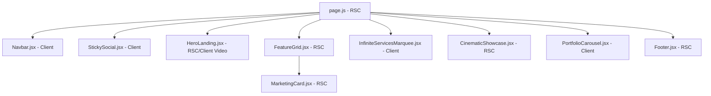

# 5. Blueprint de Migración a Next.js 14 (App Router)

Este blueprint sirve como la guía técnica y estratégica para la migración del sitio de una Single Page Application (SPA) en Vite hacia una arquitectura moderna con **Next.js 14 utilizando el App Router**.

---

## 1. División: Server Components vs. Client Components

Para optimizar el tamaño del JavaScript inicial enviado al cliente y acelerar el tiempo de carga interactivo (*Time to Interactive - TTI*), la estructura se dividirá bajo el principio: **React Server Components (RSC) por defecto, Client Components solo si es interactivo**.



### A. React Server Components (RSC)
Renderizados del lado del servidor. Generan marcado HTML estático rápido de indexar por motores de búsqueda (SEO):
*   `page.js` (Página de entrada principal).
*   `layout.js` (Estructura de la app y carga tipográfica).
*   `<FeatureGrid />` (Sección informativa estática).
*   `<MarketingCard />` (Componente de tarjeta visual estático).
*   `<CinematicShowcase />` (Contenedor multimedia).
*   `<Footer />` (Sección estática institucional).

### B. Client Components (`"use client"`)
Componentes que requieren interactividad, hooks de React, manipulación del DOM o APIs del navegador:
*   `<Navbar />`: Utiliza hooks de animación (`useScroll`, `useTransform`) y estado para el drawer.
*   `<StickySocial />`: Escucha eventos del scroll global del objeto `window`.
*   `<PortfolioCarousel />`: Manipula el desplazamiento horizontal nativo mediante referencias del DOM (`useRef`).
*   `<InfiniteServicesMarquee />`: Requiere hooks reactivos de scroll físico (`useScroll`, `useTransform`) de Framer Motion.
*   Wrappers visuales y primitivas (`FadeIn.jsx`, `RevealText.jsx`, `MotionContainer.jsx`): Manipulan e inyectan variantes directas de motion en tiempo de ejecución.

---

## 2. Seguridad en la Hidratación de SSR (Hydration Safety)

El acceso directo al objeto global `window` o variables de pantalla (`window.innerHeight`, `window.scrollY`) fuera de ciclos de vida protegidos romperá el flujo en entornos de renderizado del lado del servidor (SSR), puesto que dichas variables no existen en el servidor y generan inconsistencias en el marcado de HTML inicial.

### Patrón de Doble Render para Componentes del Cliente
Para asegurar que un componente acceda de forma segura al objeto `window` sin provocar fallas de hidratación (*Hydration Mismatches*), se debe forzar a que el componente se monte en el cliente antes de evaluar parámetros de pantalla:

```javascript
"use client";
import React, { useState, useEffect } from 'react';
import { FaFacebookF, FaTwitter, FaLinkedinIn, FaInstagram } from 'react-icons/fa';

export const StickySocial = () => {
  const [mounted, setMounted] = useState(false);
  const [isVisible, setIsVisible] = useState(false);

  useEffect(() => {
    setMounted(true);
    const handleScroll = () => {
      const threshold = window.innerHeight - 100;
      setIsVisible(window.scrollY > threshold);
    };

    window.addEventListener('scroll', handleScroll, { passive: true });
    handleScroll();

    return () => window.removeEventListener('scroll', handleScroll);
  }, []);

  // Evitar renderizado con valores incompatibles en el servidor
  if (!mounted) {
    return null;
  }

  return (
    <div id="sticky-social" className={isVisible ? 'is-visible' : ''}>
      {/* Iconos */}
    </div>
  );
};
```

---

## 3. Optimización de Imágenes con `next/image`

Las imágenes remotas del portafolio del cliente alojadas en WordPress (`mil998.com`) y las locales deben migrarse al componente `<Image />` de Next.js para habilitar compresión automática (formatos WebP o AVIF), Lazy Loading inteligente y dimensionamiento dinámico que elimina el Cumulative Layout Shift (CLS).

### Configuración de Descarga Segura (`next.config.js`)
Para descargar imágenes de forma segura desde dominios externos, configure los patrones permitidos en `next.config.js`:

```javascript
/** @type {import('next').NextConfig} */
const nextConfig = {
  images: {
    remotePatterns: [
      {
        protocol: 'https',
        hostname: 'mil998.com',
        pathname: '/wp-content/uploads/**',
      },
    ],
  },
};

module.exports = nextConfig;
```

---

## 4. Optimización de Fuentes con `next/font`

Para evitar el retardo y parpadeo visual causado por la carga tardía de fuentes externas (como Google Fonts conectadas por CDN), se deben utilizar las fuentes locales precargadas en el servidor web mediante `next/font/google`. Esto inyecta variables CSS nativas que eliminan el CLS.

### Integración en el Layout Principal (`src/app/layout.js`)
```javascript
import { Inter, Playfair_Display } from 'next/font/google';
import '../index.css';

// Configurar fuente sans-serif base
const inter = Inter({ 
  subsets: ['latin'], 
  variable: '--font-sans',
  display: 'swap'
});

// Configurar fuente serif para encabezados y logos
const playfair = Playfair_Display({ 
  subsets: ['latin'], 
  variable: '--font-serif',
  display: 'swap' 
});

export default function RootLayout({ children }) {
  return (
    <html lang="es" className={`${inter.variable} ${playfair.variable}`}>
      <body className="bg-background text-foreground antialiased font-sans">
        {children}
      </body>
    </html>
  );
}
```
**Nota de estilo**: La fuente serif se invoca dinámicamente en los componentes utilizando la clase Tailwind `font-serif` mapeada de la siguiente forma en el sistema de diseño global:
```css
.font-serif {
  font-family: var(--font-serif), Georgia, serif;
}
```
