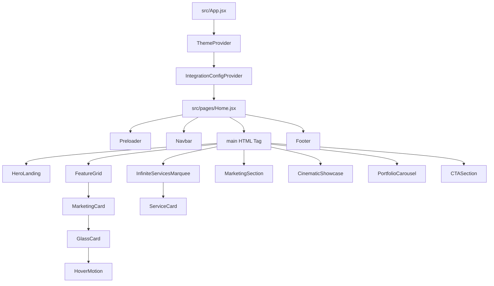

# AUDITORÍA EXHAUSTIVA Y DOCUMENTACIÓN TÉCNICA - PROYECTO 1998

Este documento presenta una auditoría técnica completa del proyecto frontend **1998**, actuando bajo los roles de **Senior Software Architect, Technical Writer, Lead Frontend/Backend Engineer, DevOps Engineer y QA Analyst**. 

El análisis se basa exclusivamente en el código fuente actual y la estructura del repositorio local, detectando oportunidades de mejora, deuda técnica, rendimiento y seguridad.

---

## ÍNDICE

1. [Resumen Ejecutivo](#resumen-ejecutivo)
2. [Fase 1: Auditoría General del Proyecto](#fase-1-auditoría-general-del-proyecto)
3. [Fase 2: Estructura Completa del Proyecto](#fase-2-estructura-completa-del-proyecto)
4. [Fase 3: Documentación de Componentes](#fase-3-documentación-de-componentes)
5. [Fase 4: Análisis de Lógica de Negocio](#fase-4-análisis-de-lógica-de-negocio)
6. [Fase 5: Análisis de Rutas y Navegación](#fase-5-análisis-de-rutas-y-navegación)
7. [Fase 6: Análisis de Estilos y UI](#fase-6-análisis-de-estilos-y-ui)
8. [Fase 7: Análisis SEO](#fase-7-análisis-seo)
9. [Fase 8: Análisis de Rendimiento (Performance)](#fase-8-análisis-de-rendimiento-performance)
10. [Fase 9: Detección de Deuda Técnica](#fase-9-detección-de-deuda-técnica)
11. [Fase 10: Seguridad](#fase-10-seguridad)
12. [Fase 11: Documentación de API](#fase-11-documentación-de-api)
13. [Fase 12: Estado Actual y Roadmap de Prioridades](#fase-12-estado-actual-y-roadmap-de-prioridades)

---

## RESUMEN EJECUTIVO

El proyecto **1998** consiste en la landing page corporativa oficial de la agencia homónima, especializada en desarrollo de software a medida, branding, publicidad digital y optimización de ventas. 

### Fortalezas Clave
1. **Modularidad e Integración del Design System**: Posee un sistema de diseño desacoplado (`src/design-system/`) con un motor de movimiento basado en `framer-motion` altamente optimizado, capaz de responder dinámicamente a las configuraciones de accesibilidad del sistema operativo (*Reduced Motion*).
2. **Interactividad Avanzada**: El componente `InfiniteServicesMarquee` implementa una experiencia premium a través de un scroll con efecto de apilamiento 3D controlado por hardware y optimizado para el consumo de GPU de dispositivos móviles.
3. **Calidad Visual**: Sigue la línea estética *Premium Dark UI* utilizando combinaciones cromáticas HSL, efectos de desenfoque gaussianos y bordes de alta fusión.

### Debilidades y Hallazgos Críticos
1. **DevOps y Build Tooling (Bloqueante)**: El script de construcción (`npm run build`) en `package.json` incluye un comando `chmod +x node_modules/.bin/vite` que falla nativamente en sistemas operativos Windows, impidiendo la compilación correcta fuera de entornos POSIX.
2. **Rendimiento Multimedia Crítico**: Los videos locales almacenados en `public/videos/` acumulan más de 250 MB. Un solo video móvil (`redes_sociales_phone.mp4`) pesa 61.8 MB. Esto genera un consumo insostenible de ancho de banda y tiempos de carga inaceptables en redes móviles.
3. **Funcionalidades Huérfanas y Bugs de UI**:
   - `Navbar.jsx` incluye un enlace de navegación para un sección `#blog` inexistente en el DOM.
   - `HeroLanding.jsx` importa múltiples primitivas del Design System que no son renderizadas en el JSX (código muerto).
   - `MarketingCard.jsx` presenta una clase duplicada con un error tipográfico (`realitive`).
   - CDN externa duplicada para `bootstrap-icons` en `index.html` a pesar de estar importado localmente en `index.css`.

---

## FASE 1: AUDITORÍA GENERAL DEL PROYECTO

### Metadatos del Proyecto
*   **Nombre del Proyecto**: `front_1998` (según `package.json`).
*   **Objetivo General**: Presentar los servicios de la agencia **1998** mediante una landing page premium, interactiva e inmersiva que convierta visitantes en clientes potenciales.
*   **Problema que Resuelve**: La falta de presencia digital de alta calidad y la necesidad de una plataforma centralizada que demuestre la excelencia técnica y artística de la agencia en el desarrollo de software y marketing.
*   **Público Objetivo**: Empresas medianas/grandes, startups y profesionales independientes que buscan branding, software a medida y campañas publicitarias.
*   **Estado de Desarrollo**: Pre-producción avanzada (Frontend terminado en un 90%; falta optimización de recursos multimedia, resolución de deuda técnica menor y conexión de formularios).

### Arquitectura General
El proyecto es una **Single Page Application (SPA)** construida sobre **React 18** y **Vite 5**. La arquitectura sigue un patrón modular con separación estricta entre:
1.  **Páginas (`src/pages/`)**: Contenedores principales de nivel superior.
2.  **Secciones (`src/components/sections/`)**: Bloques funcionales independientes del sitio.
3.  **Sistema de Diseño (`src/design-system/`)**: Paquete interno que define las constantes, configuraciones, tokens visuales, componentes atómicos y utilidades visuales de la aplicación.

#### Diagrama de Jerarquía de Componentes


### Tabla del Stack Tecnológico

| Tecnología / Librería | Versión | Tipo | Propósito |
| :--- | :--- | :--- | :--- |
| **React** | `^18.3.1` | Core Framework | Renderizado declarativo y gestión del ciclo de vida de componentes. |
| **Vite** | `^5.2.11` | Build Tool | Bundler de desarrollo rápido con Hot Module Replacement (HMR). |
| **Tailwind CSS** | `^3.4.3` | Styling | Maquetación responsive mediante clases de utilidad. |
| **PostCSS / Autoprefixer**| `^8.4.38` / `^10.4.19` | Styling Tool | Procesamiento de reglas CSS y prefijos de compatibilidad del navegador. |
| **Framer Motion** | `^11.18.2` | Animation | Motor de animaciones fluidas, físicas e interpolación de scroll. |
| **React Icons** | `^5.6.0` | UI Assets | Biblioteca de iconos vectoriales reactivos. |
| **Bootstrap Icons** | `^1.13.1` | UI Assets | Biblioteca de iconos clásica (cargada tanto local como externamente). |
| **clsx** | `^2.1.1` | Utility | Concatenación condicional de clases CSS. |
| **Tailwind Merge** | `^2.3.0` | Utility | Mezcla segura de clases de Tailwind previniendo duplicidades. |

### Configuración General del Proyecto
*   **Aliases de Ruta**: Configurados en `jsconfig.json` y `vite.config.js` mediante la directiva `@/*` apuntando a `./src/*`. Esto evita rutas relativas complejas como `../../components`.
*   **Variables de Entorno**: No se utilizan actualmente variables de entorno en el proyecto.
*   **Configuración del Tema**: La aplicación define un tema estrictamente oscuro (`dark`) de forma automática en el arranque mediante el `ThemeProvider` que manipula el DOM (`classList.add('dark')`).

---

## FASE 2: ESTRUCTURA COMPLETA DEL PROYECTO

### Árbol de Directorios Completo

```txt
front_1998/
├── dist/                          # Activos finales compilados (generados por build)
├── docs/                          # Documentación técnica (anteriormente vacía)
├── images/                        # Directorio huérfano vacío en el root
├── public/                        # Activos públicos del servidor estático
│   ├── images/                    # Imágenes estáticas corporativas (PNG)
│   ├── videos/                    # Videos de gran peso para backgrounds y secciones (MP4)
│   └── image_98fcad.PNG           # Favicon / Isotipo principal
├── src/
│   ├── assets/                    # Directorio vacío de assets dinámicos
│   ├── components/                # Componentes reactivos del sitio
│   │   ├── cards/
│   │   │   └── MarketingCard.jsx
│   │   ├── layout/
│   │   │   ├── Footer.jsx
│   │   │   ├── Navbar.jsx
│   │   │   └── Preloader.jsx
│   │   │   sections/
│   │   │   ├── CTASection.jsx
│   │   │   ├── CinematicShowcase.jsx
│   │   │   ├── FeatureGrid.jsx
│   │   │   ├── HeroLanding.jsx
│   │   │   ├── InfiniteServicesMarquee.jsx
│   │   │   └── MarketingSection.jsx
│   │   └── PortfolioCarousel.jsx
│   ├── design-system/             # Núcleo visual del proyecto
│   │   ├── integration/
│   │   │   ├── wrappers/          # Directorio vacío (diseñado para layouts legacy)
│   │   │   ├── featureFlags.js
│   │   │   ├── IntegrationConfigProvider.jsx
│   │   │   ├── migrationModes.js
│   │   │   ├── performanceBudgets.js
│   │   │   ├── ThemeContext.jsx
│   │   │   └── useIntegrationConfig.js
│   │   ├── layout/
│   │   │   └── index.js           # Deprecado (vacío)
│   │   ├── motion/
│   │   │   ├── easingPresets.js
│   │   │   ├── index.js
│   │   │   ├── motionVariants.js
│   │   │   └── useReducedMotionGlobal.js
│   │   ├── playground/            # Directorio vacío
│   │   ├── tokens/
│   │   │   └── theme.css
│   │   ├── ui/
│   │   │   ├── AntiGravity.jsx
│   │   │   ├── FadeIn.jsx
│   │   │   ├── GlassCard.jsx
│   │   │   ├── HoverMotion.jsx
│   │   │   ├── index.js
│   │   │   ├── MotionContainer.jsx
│   │   │   ├── PremiumButton.jsx
│   │   │   └── RevealText.jsx
│   │   ├── utils/
│   │   │   ├── cn.js
│   │   │   └── index.js
│   │   └── index.js
│   ├── pages/
│   │   └── Home.jsx
│   ├── App.jsx
│   ├── index.css
│   └── main.jsx
├── index.html
├── jsconfig.json
├── package.json
├── postcss.config.js
├── tailwind.config.js
└── vite.config.js
```

### Análisis Detallado de Directorios y Archivos

#### 1. Carpetas del Sistema (`src/`)

*   **`src/design-system/`**: 
    *   *Propósito*: Centralizar la biblioteca de UI del proyecto.
    *   *Responsabilidad*: Asegurar consistencia visual y animaciones uniformes.
    *   *Relación*: Suministra componentes a todas las carpetas del sitio.
    *   *Flujo de datos*: Expone variables CSS, hooks de accesibilidad y wrappers de contexto.
*   **`src/components/layout/`**:
    *   *Propósito*: Controlar el cascarón visual del sitio (Navbar, Footer, Preloader).
    *   *Responsabilidad*: Gestionar la navegación del usuario y los tiempos de arranque.
*   **`src/components/sections/`**:
    *   *Propósito*: Alojar los diferentes bloques verticales de la landing page.
    *   *Responsabilidad*: Presentar los servicios e interactividades particulares de cada sección.
*   **`src/pages/`**:
    *   *Propósito*: Orquestador de la visualización final. Actualmente contiene `Home.jsx` que reúne las secciones en un único canvas SPA.

#### 2. Matriz de Archivos e Importancia Técnica

| Archivo | Función Principal | Responsabilidad | Dependencias | Nivel de Importancia |
| :--- | :--- | :--- | :--- | :--- |
| **`main.jsx`** | Punto de entrada JS | Inicializar la app y montar el árbol React en el elemento `#root` del DOM. | `react`, `react-dom/client`, `App.jsx`, `index.css` | **Crítica** (Cualquier error rompe el montaje del sitio) |
| **`App.jsx`** | Orquestador raíz | Envolver el sitio en los proveedores de tema y configuración del design system. | `ThemeContext`, `IntegrationConfigProvider`, `Home.jsx` | **Crítica** |
| **`Home.jsx`** | Canvas de la Landing | Orquestar la carga de todas las secciones en el orden correcto y renderizar el preloader. | `Navbar`, `Footer`, `Preloader`, Secciones del sitio | **Crítica** |
| **`Preloader.jsx`** | Bloqueador de carga | Mostrar una animación fluida de cortina líquida mientras se miden las dimensiones de pantalla. | `framer-motion`, hooks internos | **Alta** |
| **`Navbar.jsx`** | Navegación del sitio | Cambiar estilos al hacer scroll y gestionar el menú colapsable responsive en móviles. | `framer-motion`, `@/design-system` | **Alta** |
| **`InfiniteServicesMarquee.jsx`** | Galería de Servicios | Renderizar tarjetas que se apilan interactivamente a medida que el usuario hace scroll. | `framer-motion`, `useScroll`, `useTransform` | **Alta** |
| **`PortfolioCarousel.jsx`**| Carrusel de Proyectos | Presentar proyectos web realizados, con un centrado programático automático en el arranque. | `framer-motion`, `@/design-system` | **Alta** |
| **`theme.css`** | Core de Estilos | Declarar fuentes locales y variables HSL de color para toda la app. | `@tailwind` directives | **Crítica** |
| **`cn.js`** | Utilidad visual | Resolver conflictos de clases CSS dinámicas mediante twMerge. | `clsx`, `tailwind-merge` | **Alta** |
| **`useReducedMotionGlobal.js`**| Accesibilidad | Detectar preferencias del sistema operativo para desactivar o suavizar movimientos. | `framer-motion` | **Alta** |

---

## FASE 3: DOCUMENTACIÓN DE COMPONENTES

### 1. `Preloader`
*   **Ubicación**: `src/components/layout/Preloader.jsx`
*   **Tipo**: React Functional Component (Client-side animated overlay)
*   **Responsabilidad**: Bloquear el scroll del body y reproducir una animación de salida líquida al completarse la carga base del sitio (800ms).

#### Props
| Prop | Tipo | Requerido | Valor por defecto | Descripción |
| :--- | :--- | :--- | :--- | :--- |
| `onComplete` | `function` | **Sí** | - | Callback disparado cuando el temporizador interno de 800ms expira, iniciando la salida del componente. |

#### Estados (useState)
*   `dimensions` (`{ width: 0, height: 0 }`): Guarda el ancho y alto del viewport detectados dinámicamente. Evita discrepancias entre renderizado de servidor y de cliente.

#### Hooks Utilizados
*   `useState`: Para almacenar las dimensiones físicas del viewport.
*   `useEffect` (3 instancias):
    1.  *Medición*: Registra el ancho y alto inicial en el navegador y adjunta un listener `'resize'` para mantenerlo actualizado. Limpia el evento al desmontarse.
    2.  *Bloqueo de Scroll*: Al montar, inyecta `overflow: 'hidden'` en `document.body` y restaura el overflow original al desmontar.
    3.  *Temporizador*: Dispara un `setTimeout` de 800ms que invoca la función `onComplete()`.

#### Flujo de Renderizado
1.  **Montaje**:
    *   Se calcula la dimensión de pantalla y se bloquea el scroll del body.
    *   Se inicia un temporizador de 800ms.
    *   Se dibuja la cortina SVG cubriendo el 100% de la pantalla más un arco curvo inferior de 300px (`Q${width / 2} ${height + 300}`).
2.  **Actualización**:
    *   Si se altera el tamaño de pantalla, se actualizan las dimensiones en el estado provocando un re-render.
3.  **Desmontaje (Exit)**:
    *   La función `onComplete` cambia el estado padre `isLoading` a `false`.
    *   Framer Motion anima el atributo `d` del path del SVG encogiéndolo a cero (`targetPath` plano en el eje `y: 0`).
    *   Se restaura el scroll del body y el componente se retira del DOM.

---

### 2. `InfiniteServicesMarquee` (Componente de Alta Complejidad)
*   **Ubicación**: `src/components/sections/InfiniteServicesMarquee.jsx`
*   **Tipo**: Scroll-linked Complex Interactive Section
*   **Responsabilidad**: Renderizar una sección de servicios interactivos donde cada elemento se bloquea de forma pegajosa (`sticky`) y se apila, escalándose hacia atrás y oscureciéndose al avanzar el scroll.

#### Subcomponente: `ServiceCard`
Presenta la información individual de cada servicio.

#### Props (`ServiceCard`)
| Prop | Tipo | Requerido | Valor por defecto | Descripción |
| :--- | :--- | :--- | :--- | :--- |
| `service` | `object` | **Sí** | - | Objeto con el título, descripción y rutas de los videos correspondientes. |
| `index` | `number` | **Sí** | - | Índice de la tarjeta dentro de la colección. |
| `N` | `number` | **Sí** | - | Número total de tarjetas para calcular proporciones matemáticas. |
| `scrollYProgress` | `MotionValue` | **Sí** | - | Instancia de MotionValue que mide el progreso del scroll del contenedor padre. |

#### Estados (`ServiceCard`)
*   `isMobile` (`boolean`): Bandera para cargar condicionalmente los videos optimizados para móviles (`_phone.mp4`) en lugar de los de escritorio.

#### Hooks Utilizados (`ServiceCard`)
*   `useRef` (2 instancias):
    *   `containerRef`: Apunta al contenedor envolvente de la tarjeta para verificar su visibilidad.
    *   `videoRef`: Referencia al nodo HTML5 `<video>` para controlar su ciclo de reproducción programático.
*   `useInView`: Hook de `framer-motion` para detectar si el 10% del elemento se encuentra en pantalla.
*   `useTransform` (2 instancias):
    *   `scale`: Reduce el tamaño de la tarjeta al ser empujada por la siguiente.
    *   `darken`: Aumenta el nivel de negro en un div superpuesto al perder foco.

#### Ciclo de Reproducción de Video Optimizado
Para mitigar el consumo de memoria GPU, el hook `useInView` activa la reproducción del video solo si la tarjeta está visible:
```javascript
useEffect(() => {
  if (videoRef.current) {
    if (isInView) {
      videoRef.current.muted = true;
      videoRef.current.play().catch(err => console.log(err));
    } else {
      videoRef.current.pause();
    }
  }
}, [isInView]);
```

---

### 3. `Navbar`
*   **Ubicación**: `src/components/layout/Navbar.jsx`
*   **Tipo**: Smart Header Component
*   **Responsabilidad**: Brindar acceso a las diferentes secciones del sitio y cambiar su fondo estético a un efecto acristalado dinámico al pasar de los 50px de scroll vertical.

#### Props
| Prop | Tipo | Requerido | Valor por defecto | Descripción |
| :--- | :--- | :--- | :--- | :--- |
| `isLoading` | `boolean` | **Sí** | - | Estado de carga global controlado por el preloader. Si es verdadero, oculta el Navbar subiéndolo -100px. |

#### Estados
*   `isOpen` (`boolean`): Controla el estado abierto/cerrado del menú móvil colapsable.

#### Hooks Utilizados
*   `useState`: Para abrir o cerrar el panel móvil.
*   `useScroll`: Obtiene la referencia reactiva al scroll vertical global (`scrollY`).
*   `useTransform` (3 instancias):
    *   `backgroundColor`: Interpola de transparente (`rgba(10,10,10,0)`) a un tono opaco con vidrio (`rgba(10,10,10,0.85)`) en el rango de scroll `[0, 50]`.
    *   `backdropBlur`: Interpola el desenfoque del fondo de `blur(0px)` a `blur(12px)` en el rango `[0, 50]`.
    *   `borderBottom`: Añade un borde sutil (`rgba(255,255,255,0.08)`) al deslizar hacia abajo.
*   `useIntegrationConfig`: Lee la bandera `flags.enableGlassEffects` para saber si debe aplicar el filtro acristalado.

---

### 4. `PortfolioCarousel`
*   **Ubicación**: `src/components/PortfolioCarousel.jsx`
*   **Tipo**: Horizontal Custom Snap Carousel
*   **Responsabilidad**: Renderizar el catálogo de proyectos con centrado automático en el proyecto inicial recomendado (`isStart: true`).

#### Hooks Utilizados
*   `useRef` (`carouselRef`): Apunta al div contenedor del scroll horizontal.
*   `useEffect`: Se ejecuta una única vez tras el montaje. Busca el elemento hijo que tenga la clase `.scroll-start` (el proyecto *Electrocercos*), calcula su offset lateral en base al tamaño del contenedor y lo centra matemáticamente mediante manipulación directa de la propiedad `scrollLeft`.

---

### 5. `AntiGravity` (Componente de Movimiento)
*   **Ubicación**: `src/design-system/ui/AntiGravity.jsx`
*   **Tipo**: Motion Wrapper Utility
*   **Responsabilidad**: Proveer una animación perpetua de levitación en el eje Y respetando las directivas del sistema operativo.

#### Props
| Prop | Tipo | Requerido | Valor por defecto | Descripción |
| :--- | :--- | :--- | :--- | :--- |
| `children` | `ReactNode` | **Sí** | - | Contenido que recibirá la levitación. |
| `className`| `string` | No | `""` | Clases de estilo CSS adicionales. |
| `delay` | `number` | No | `0` | Retardo del ciclo flotante inicial. |
| `duration` | `number` | No | `4` | Segundos para completar el ciclo de subida y bajada. |
| `yDistance`| `number` | No | `-12` | Distancia en píxeles de desplazamiento vertical. |

#### Hooks Utilizados
*   `useReducedMotionGlobal`: Retorna la bandera `prefersReduced` de las configuraciones globales.

---

## FASE 4: ANÁLISIS DE LÓGICA DE NEGOCIO

Al tratarse de una landing page puramente corporativa, la lógica de negocio se enfoca en la **experiencia del usuario interactiva, rendimiento perceptivo y adaptabilidad de layouts**.

### 1. Regla de Apilamiento Progresivo (Stacking Logic)
*   **Ubicación**: `ServiceCard` dentro de `InfiniteServicesMarquee.jsx`
*   **Qué hace**: Calcula matemáticamente el tamaño (`scale`) y la atenuación de luz (`darken`) de cada tarjeta en función del scroll.
*   **Por qué existe**: Evita calcular valores ad-hoc para cada tarjeta. Se basa en una iteración que evalúa la profundidad (`depth = j - index`). Por cada nivel de profundidad hacia abajo en la pila, la tarjeta se encoge un 5% (`1 - (depth * 0.05)`) y se oscurece linealmente hasta un tope de 0.75 de opacidad.
*   **Dependencias**: `useTransform` de `framer-motion`.

### 2. Detección Reactiva de Preferencias de Movimiento Reducido
*   **Ubicación**: `useReducedMotionGlobal.js`
*   **Qué hace**: Actúa como un middleware de accesibilidad física. 
*   **Por qué existe**: Garantiza la conformidad con estándares de accesibilidad WCAG. Si un usuario tiene activado "Reducir movimiento" en Windows u macOS, el hook convierte todas las animaciones complejas en simples desvanecimientos instantáneos (`safeDuration: 0.01`, `safeY: 0`, `safeStagger: 0`).
*   **Dependencias**: `useReducedMotion` de `framer-motion`.

### 3. Orquestador de Integración y Migration Modes
*   **Ubicación**: `IntegrationConfigProvider.jsx`
*   **Qué hace**: Aplica un modo de compatibilidad progresiva (`SOFT`, `HYBRID`, `FULL`) sobre el motor visual.
*   **Por qué existe**: Facilita la transición de código heredado (legacy) a la suite premium. Si se selecciona el modo `SOFT`, la aplicación desactiva automáticamente staggers y transiciones pesadas de forma global para prevenir la degradación de FPS en navegadores desactualizados.

---

## FASE 5: ANÁLISIS DE RUTAS Y NAVEGACIÓN

El proyecto **no incluye un router a nivel de cliente** (por ejemplo, `react-router-dom`). Toda la navegación se basa en una estructura SPA conducida por selectores e identificadores en el DOM.

### Tabla de Rutas Virtuales (Scroll Anchors)

| Ruta de Anclaje | Componente Destino | Protección | Descripción |
| :--- | :--- | :--- | :--- |
| **`#inicio`** | `HeroLanding` | Pública | Sección introductoria con video interactivo. |
| **`#como-trabajamos`**| `FeatureGrid` | Pública | Muestra los 3 pilares operativos de la agencia. |
| **`#planes`** | `CTASection` | Pública | Opciones comerciales y redirección a contacto. |
| **`#portafolio`** | `PortfolioCarousel` | Pública | Carrusel con snaps de proyectos exitosos. |
| **`#blog`** | **Ninguno (Huérfano)** | Pública | **Ruta rota**. Existe en la navegación pero no tiene un contenedor real en la vista. |

### Mecanismos de Navegación
*   **Navegación Declarativa**: Utilizada en el pie de página (`Footer.jsx`) mediante enlaces planos (`<a href="#">`).
*   **Navegación Programática**: Utilizada en el menú de navegación (`Navbar.jsx`). Al hacer clic en un botón, se captura el evento, se previene el comportamiento por defecto y se ejecuta `scrollIntoView` de forma nativa con animación fluida:
    ```javascript
    const handleNavClick = (e, targetId) => {
      e.preventDefault();
      const element = document.getElementById(targetId);
      if (element) {
        element.scrollIntoView({ behavior: 'smooth' });
      }
      setIsOpen(false);
    };
    ```
*   **Lazy Loading**: No hay lazy loading de componentes visuales, todos los componentes se cargan sincrónicamente en el bundle inicial a través de `Home.jsx`. Sin embargo, el carrusel de portafolio sí utiliza carga diferida nativa de imágenes (`loading="lazy"`).

---

## FASE 6: ANÁLISIS DE ESTILOS Y UI

### Configuración del Sistema de Diseño
El diseño utiliza **Tailwind CSS v3** complementado con variables CSS puras inyectadas a través de la capa `@layer base` de Tailwind en `theme.css`.

#### 1. Paleta de Colores HSL
*   **`--background`**: `0 0% 4%` (Negro absoluto, equivalente a `#0a0a0a`).
*   **`--foreground`**: `0 0% 98%` (Blanco roto).
*   **`--card`**: `0 0% 7%` (Gris oscuro para destacar contenedores).
*   **`--border`**: `0 0% 12%` (Gris fino diseñado para fundirse con el fondo).
*   **`--glow-primary`**: `0 0% 98%` (Destello blanco).
*   **`--glow-secondary`**: `217.2 91.2% 59.8%` (Gris azulado premium).

#### 2. Tipografías Declaradas
*   **Display (Títulos Cinematográficos)**: `'Klein Condensed'`, con fallbacks a `'Impact'` y `'Arial Black'`.
*   **Heading (Subtítulos de Sección)**: `'Poppins'`, con fallbacks a `system-ui`.
*   **Arabic (Localización)**: `'DIN Arabic'`, para soporte nativo de lectura derecha a izquierda (RTL) si se activa `lang="ar"`.
*   **Serif (Estilo Editorial)**: `'Playfair Display'`, cargado externamente en `index.html`.

#### 3. Escala Tipográfica Fluida
Se aplican modificadores `clamp` en `theme.css` para ajustar de forma responsiva el tamaño de las fuentes sin necesidad de escribir múltiples breakpoints manuales:
*   `.text-fluid-display`: `clamp(2.5rem, 6vw, 4.5rem)`
*   `.text-fluid-h1`: `clamp(2rem, 5vw, 3.5rem)`

---

## FASE 7: ANÁLISIS SEO

### Estado Actual de SEO en `index.html`

*   **Meta Tags Básicos**: Correctos. Posee etiquetas de codificación UTF-8, viewport de escala móvil, descripción de 150 caracteres y keywords descriptivas.
*   **Open Graph (Compartido Social)**:
    *   *Título*: `1998 | Desarrollo de Software & Marketing Digital` (Correcto).
    *   *Imagen*: `<meta property="og:image" content="https://tu-dominio.com/ruta-a-tu-imagen-og.jpg" />` (Pendiente de reemplazar por la URL definitiva de despliegue).
    *   *URL*: Apunta a `https://tu-dominio.com` (Pendiente de configuración).
*   **Estructura Semántica**: Correcta en gran parte del sitio. Se utiliza la etiqueta `<main>` y pies de página (`<footer>`).
*   **Sitemap y Robots**: **Ausentes**. No existen archivos `sitemap.xml` ni `robots.txt` en el servidor estático (`public/`), lo que dificulta el rastreo óptimo de los bots de Google.

---

## FASE 8: ANÁLISIS DE RENDIMIENTO (PERFORMANCE)

Se realizó un análisis técnico del impacto de carga del bundle y del consumo del procesador / memoria del cliente.

### Diagnóstico de Hallazgos Críticos de Rendimiento

#### 1. Peso Desmesurado de Archivos Multimedia (Prioridad: ALTA)
El proyecto almacena archivos de video MP4 directamente en el repositorio local para reproducirlos en bucle en el fondo. El peso de estos archivos supera los estándares tolerados de la web moderna:
*   `public/videos/redes_sociales_phone.mp4`: **61.8 MB** (Catastrófico para conexiones móviles 4G).
*   `public/videos/web_app.mp4`: **27.6 MB**.
*   `public/videos/publicidad_digital.mp4`: **25.1 MB**.
*   `public/videos/Branding.mp4`: **23.8 MB**.
*   **Impacto**: Genera retrasos severos en la interactividad inicial y posibles penalizaciones en Google PageSpeed.

#### 2. Procesamiento de Redimensionamiento (Resize) sin Debounce (Prioridad: MEDIA)
En `Preloader.jsx`, la función encargada de recalcular la escala del SVG en tiempo real se ejecuta con cada pixel de cambio en el ancho de la ventana:
```javascript
const handleResize = () => {
  setDimensions({ width: window.innerWidth, height: window.innerHeight });
};
```
*   **Impacto**: Genera *Layout Thrashing* (cálculos repetitivos del árbol de renderizado del navegador) degradando temporalmente los FPS de la pantalla si se redimensiona bruscamente.

---

## FASE 9: DETECCIÓN DE DEUDA TÉCNICA

### Tabla de Deuda Técnica Encontrada

| Problema | Ubicación | Impacto | Solución Recomendada |
| :--- | :--- | :--- | :--- |
| **Comando `chmod` incompatible en Windows** | `package.json` (Línea 8) | **Crítico**. Impide ejecutar `npm run build` en entornos Windows locales. | Eliminar `chmod +x node_modules/.bin/vite &&` de la directiva de compilación. |
| **Imports Inútiles (Código Muerto)** | `HeroLanding.jsx` (Líneas 1-7) | **Bajo**. Aumenta ligeramente el peso del archivo pero no afecta la ejecución. | Limpiar los módulos importados que no se renderizan en el componente. |
| **Clase Duplicada y Typo en Estilos** | `MarketingCard.jsx` (Línea 15) | **Bajo**. Inyecta una cadena de estilo mal redactada (`realitive` en lugar de `relative`). | Corregir a `"relative flex flex-col items-center text-center h-full group"`. |
| **Enlace de Navegación Roto** | `Navbar.jsx` (Líneas 63 y 167) | **Medio**. El enlace "Blog" no lleva a ninguna parte porque no existe un ID `#blog`. | Implementar una sección informativa de Blog o apuntar el enlace a un sitio externo. |
| **Doble Importación de Iconos** | `index.html` e `index.css` | **Bajo**. Descarga dos veces el motor de Bootstrap Icons (vía CDN y local). | Remover la etiqueta `<link>` CDN de `index.html` para priorizar la carga del bundler. |
| **Directorios Huérfanos Vacíos** | Root `images/`, `src/assets/`, `wrappers/` | **Bajo**. Genera confusión en la jerarquía del repositorio para nuevos desarrolladores. | Remover los directorios si no se van a utilizar a corto plazo. |

---

## FASE 10: SEGURIDAD

El sitio web es una aplicación de frontend de carácter puramente estático, lo que reduce sustancialmente el vector de ataque al no persistir datos en un backend propio ni permitir la entrada dinámica de entradas de texto.

### Recomendaciones de Seguridad Arquitectónica
1.  **Content Security Policy (CSP)**:
    Implementar directivas en las cabeceras HTTP del servidor de hosting (ej. Vercel, Netlify o Cloudflare) para restringir el origen de scripts. Asegurar que solo se permitan fuentes desde Google Fonts (`fonts.googleapis.com`) y el propio dominio para evitar ataques de inyección indirecta (XSS).
2.  **HTTPS HSTS**:
    Asegurar que el hosting final configure redirecciones automáticas 301 a conexiones seguras SSL (HTTPS) y aplique la directiva HSTS para forzar cifrado en el navegador.

---

## FASE 11: DOCUMENTACIÓN DE API

**No existen integraciones de API ni servicios backend en el estado actual del repositorio.** Toda la información de proyectos, servicios y características se encuentra codificada localmente en formato estructurado (*hardcoded* en arrays de Javascript).

### Recomendación para el Futuro Desarrollo de la API
Si se decide migrar a un modelo dinámico de portafolio o integrar un formulario de contacto:
1.  **Formulario de Contacto**: Utilizar un proveedor *serverless* como Netlify Forms, Formspree o un endpoint API REST sobre Next.js Server Actions para enviar correos electrónicos de leads.
2.  **Gestión de Proyectos**: Utilizar un CMS Headless (ej: Strapi, Sanity o Contentful) que exponga un endpoint `GET /api/projects` para desacoplar los datos estáticos de `PortfolioCarousel.jsx`.

---

## FASE 12: ESTADO ACTUAL Y ROADMAP DE PRIORIDADES

### Funcionalidades Completadas
*   [x] Estructura global e integración de tokens HSL de color.
*   [x] Navegación inteligente de Navbar con interpolación de scroll.
*   [x] Bloqueo de scroll y animación fluida de salida del preloader.
*   [x] Apilamiento 3D interactivo en la sección de Servicios (`InfiniteServicesMarquee`).
*   [x] Centrado programático inicial en el Carrusel de Proyectos.
*   [x] Soporte global y silencioso para Reduced Motion en componentes Framer Motion.

### Funcionalidades Parcialmente Implementadas
*   [/] Carga responsiva en Hero: Los videos se cargan, pero carecen de una compresión adecuada para producción.
*   [/] Enlaces de redes sociales en el pie de página apuntan a dominios genéricos (`facebook.com`, `twitter.com`).

### Funcionalidades Pendientes
*   [ ] Creación de la sección "Blog" o su enlace definitivo.
*   [ ] Creación de un formulario real de envío de correos (enlace actual del botón "Escríbenos" no realiza ninguna llamada).
*   [ ] Archivos de auditoría SEO (`sitemap.xml` y `robots.txt`).

### Plan de Prioridades Sugerido

#### 1. Prioridad Alta (Bloqueante)
*   **Corrección del Build Script**: Modificar `package.json` para eliminar `chmod +x node_modules/.bin/vite` y permitir compilación nativa en Windows.
*   **Optimización de Videos**: Pasar todos los archivos de video por un proceso de compresión de video (ej. Handbrake o FFmpeg) reduciendo la resolución, reduciendo el bitrate a 800kbps o utilizando el codec WebM/MP4 optimizado.
*   **Remoción del Doble CDN**: Eliminar el tag de Bootstrap Icons CDN en `index.html`.

#### 2. Prioridad Media (Deuda Técnica y UX)
*   **Resolver la sección "Blog"**: Crear una sección básica o redirigir el clic a una plataforma de blogs externa para evitar el anclaje roto en el Navbar.
*   **Optimizar Redimensionamiento (Resize)**: Aplicar un limitador de frecuencia (*debounce* de 150ms) en la función de resize en `Preloader.jsx` para proteger la carga del procesador.
*   **Limpiar Código Muerto**: Quitar las importaciones sin uso en `HeroLanding.jsx` y corregir la clase duplicada en `MarketingCard.jsx`.

#### 3. Prioridad Baja (SEO y SEO Técnico)
*   **Agregar robots.txt y sitemap.xml**: Subir ambos archivos al directorio `public/` especificando las directivas básicas de rastreo y la dirección final de producción.
*   **Reemplazar placeholders de dominio**: Cambiar `https://tu-dominio.com` en `index.html` por la URL oficial del hosting de la agencia.
