# DOCUMENTACIÓN TÉCNICA EXHAUSTIVA: PROYECTO 1998 (FRONTEND)

## 1. INTRODUCCIÓN

El proyecto frontend **1998** representa la plataforma web corporativa y landing page interactiva de la agencia homónima, especializada en desarrollo de software a medida, branding, publicidad digital y automatización de ventas. 

Diseñado con un enfoque estético cinematográfico de gama alta (*Premium Dark UI*), el sitio opera como una Single Page Application (SPA) de alto rendimiento. Su arquitectura visual e interactiva está estructurada para sumergir al usuario en una experiencia interactiva premium de baja latencia y alta fluidez visual, optimizando el consumo de hardware gráfico (GPU) e implementando criterios robustos de accesibilidad física (como el soporte nativo para *Reduced Motion*).

Esta documentación sirve como la guía técnica principal para desarrolladores, diseñadores de UI/UX y analistas de QA, detallando desde el entorno de ejecución hasta la implementación avanzada de estilos y animaciones con GSAP.

---

## 2. REQUISITOS PREVIOS

Para ejecutar, modificar o compilar el proyecto en un entorno local, se deben cumplir los siguientes requisitos de software:

*   **Node.js**: Versión 18.0.0 o superior (se recomienda la última versión LTS).
*   **Administrador de Paquetes**: `npm` v9.0.0 o superior (incluido por defecto con Node.js), `yarn` o `pnpm`.
*   **Sistemas Operativos**:
    *   *Windows*: Compatible (requiere terminal PowerShell, Git Bash o Command Prompt).
    *   *macOS / Linux*: Totalmente compatible en entornos basados en POSIX.
*   **Navegadores Soportados**: Navegadores modernos con soporte completo para variables CSS, `backdrop-filter` (Safari 9+, Chrome 76+, Firefox 70+), animaciones CSS3, y aceleración por hardware.

---

## 3. PASOS DE INSTALACIÓN Y CONFIGURACIÓN

Siga los siguientes pasos para clonar el repositorio, instalar las dependencias requeridas (incluyendo la suite de GSAP para animaciones avanzadas) e iniciar el servidor de desarrollo:

### 1. Clonar el repositorio e instalar dependencias iniciales
Acceda al directorio del proyecto y ejecute la instalación de dependencias base:
```bash
npm install
```

### 2. Configurar la Suite de Animaciones Avanzadas (GSAP)
Dado que el proyecto requiere transiciones avanzadas y control del scroll con GSAP, asegúrese de agregar GSAP y su adaptador oficial para React a las dependencias de producción:
```bash
npm install gsap @gsap/react
```
*Nota: `@gsap/react` proporciona el hook `useGSAP` que resuelve automáticamente la limpieza de efectos y fugas de memoria en el ciclo de vida de React.*

### 3. Ejecutar el Entorno de Desarrollo
Inicie el servidor de desarrollo basado en Vite:
```bash
npm run dev
```
*   Por defecto, Vite levantará el servidor en `http://localhost:5173`. Este entorno incluye soporte para Hot Module Replacement (HMR).

### 4. Compilar para Producción
Para compilar y optimizar el sitio generando archivos estáticos minimizados en la carpeta `/dist`:
```bash
npm run build
```
> [!IMPORTANT]
> **Compatibilidad en Windows**: Si el script `build` en `package.json` incluye el comando POSIX `chmod +x node_modules/.bin/vite &&`, elimínelo en sistemas operativos Windows para evitar fallos de ejecución. La directiva correcta para compilación multiplataforma debe ser:
> ```json
> "scripts": {
>   "build": "vite build"
> }
> ```

---

## 4. ESTRUCTURA DE DIRECTORIOS

El proyecto se organiza bajo una estructura modular que separa las responsabilidades del sistema de diseño (Design System), los componentes visuales de la interfaz y la lógica de negocio/integración:

```txt
front_1998/
├── dist/                          # Código de producción optimizado (generado por build)
├── docs/                          # Documentación técnica específica del proyecto
│   ├── DOCUMENTACION_TECNICA.md   # [Este documento] Master de documentación
│   ├── 4-framework-de-integracion.md
│   ├── 5-blueprint-migracion-nextjs.md
│   └── 6-qa-y-normas-de-seguridad.md
├── public/                        # Activos estáticos servidos directamente por el servidor web
│   ├── fonts/                     # Fuentes tipográficas del sistema (.woff, .woff2, .ttf)
│   ├── images/                    # Imágenes estáticas optimizadas en formato PNG/WebP
│   └── videos/                    # Videos de alto peso para fondos y demostraciones visuales (MP4/WebM)
├── src/                           # Directorio raíz del código fuente de la aplicación
│   ├── assets/                    # Assets dinámicos del bundler (imágenes y recursos multimedia locales)
│   ├── components/                # Componentes React específicos de la lógica de la página
│   │   ├── cards/                 # Tarjetas de presentación de datos (ej: MarketingCard.jsx)
│   │   ├── layout/                # Cascarón global del sitio (Navbar, Footer, Preloader)
│   │   ├── sections/              # Secciones verticales de la Landing Page (Hero, FeatureGrid, CTA)
│   │   └── PortfolioCarousel.jsx  # Carrusel horizontal especializado con centrado programático
│   ├── design-system/             # Núcleo de diseño, estilos y comportamiento visual
│   │   ├── integration/           # Proveedores y configs de compatibilidad (Migration Modes, Feature Flags)
│   │   ├── motion/                # Ajustes físicos, staggers y hooks de accesibilidad (Framer Motion / GSAP adapters)
│   │   ├── tokens/                # HSL y definiciones tipográficas centrales (theme.css)
│   │   ├── ui/                    # Componentes atómicos reutilizables (GlassCard, RevealText, PremiumButton)
│   │   └── utils/                 # Utilidades helper de mezcla de estilos (cn.js)
│   ├── pages/                     # Páginas de nivel superior de la aplicación (Home.jsx)
│   ├── App.jsx                    # Componente raíz orquestador de contextos y páginas
│   ├── index.css                  # Punto de entrada CSS central
│   └── main.jsx                   # Punto de entrada de inicialización de React (DOM mounting)
├── index.html                     # Archivo HTML5 base del sitio web
├── jsconfig.json                  # Mapeo de aliases de rutas (@/*) y configuración de JS
├── postcss.config.js              # Configuración de PostCSS para procesar Tailwind CSS
├── tailwind.config.js             # Configuración del motor Tailwind CSS v3
└── vite.config.js                 # Configuración del empaquetador y bundler Vite
```

---

## 5. ARQUITECTURA GENERAL (REACT Y NEXT.JS)

El proyecto está diseñado bajo un modelo híbrido transicional. Actualmente funciona como una **SPA robusta basada en React y Vite**, pero contiene la arquitectura lógica y los adaptadores necesarios para realizar una migración progresiva hacia **Next.js (App Router)**.

```mermaid
graph TD
    App[src/App.jsx] --> ThemeProvider[ThemeContext]
    ThemeProvider --> IntegrationConfigProvider[IntegrationConfigProvider]
    IntegrationConfigProvider --> Home[src/pages/Home.jsx]
    
    Home --> Preloader[Preloader]
    Home --> Navbar[Navbar]
    Home --> main[main HTML Tag]
    Home --> Footer[Footer]
    
    main --> HeroLanding[HeroLanding]
    main --> FeatureGrid[FeatureGrid]
    main --> InfiniteServicesMarquee[InfiniteServicesMarquee]
    main --> PortfolioCarousel[PortfolioCarousel]
    main --> CTASection[CTASection]
```



### 5.1. Proveedor de Integración y Feature Flags
La flexibilidad de la arquitectura está regulada por el `IntegrationConfigProvider` (`src/design-system/integration/IntegrationConfigProvider.jsx`). Este componente lee el modo de migración actual y ajusta las características visuales automáticamente:

1.  **Modos de Migración (`migrationModes.js`)**:
    *   `SOFT` (`'soft'`): Desactiva staggers y animaciones pesadas de forma preventiva para optimizar el rendimiento en dispositivos y navegadores legacy.
    *   `HYBRID` (`'hybrid'`): Activa animaciones estándar de baja fricción física combinando elementos legacy y premium (Modo por defecto).
    *   `FULL` (`'full'`): Habilita la experiencia cinematográfica al 100% (staggers, desenfoques gaussianos intensos y transiciones multi-capa).
2.  **Feature Flags (`featureFlags.js`)**:
    *   Permite activar o desactivar selectivamente efectos de glassmorphism (`enableGlassEffects`), botones premium (`enablePremiumUI`), animaciones (`enableMotion`) y staggers secuenciales (`enableStagger`).

### 5.2. Blueprint de Migración a Next.js (App Router)
Para migrar el proyecto a Next.js, se debe respetar la separación entre renderizado de servidor y de cliente para garantizar una excelente indexación SEO y velocidad de carga:

*   **React Server Components (RSC - Por Defecto)**:
    Los componentes estáticos deben compilarse en el servidor sin inyectar JS innecesario al cliente. Esto incluye: `Home.jsx` (orquestador de página), `FeatureGrid.jsx`, `CTASection.jsx`, y `Footer.jsx`.
*   **Client Components (`"use client"`)**:
    Deben marcarse explícitamente con `"use client"` aquellos componentes que utilizan hooks (`useState`, `useEffect`), interactividad del navegador o API visuales de GSAP/Framer Motion. Esto incluye: `Navbar.jsx`, `Preloader.jsx`, `InfiniteServicesMarquee.jsx` y todas las primitivas visuales de `src/design-system/ui/*`.

#### Resolución de Conflictos de Hidratación en SSR (Next.js)
Al consumir variables o APIs del navegador (`window`, `document`) en el servidor, ocurrirán discrepancias de hidratación (*Hydration Mismatches*). Se implementa el siguiente patrón de montaje seguro:

```javascript
import { useState, useEffect } from 'react';

export default function SafeClientComponent({ children }) {
  const [mounted, setMounted] = useState(false);

  useEffect(() => {
    setMounted(true);
  }, []);

  if (!mounted) {
    // Retorna una caja de relleno estática idéntica a la generada por SSR
    return <div className="fixed inset-0 bg-[#000000] z-[9999]" />;
  }

  return <>{children}</>;
}
```

---

## 6. GUÍA DE ESTILOS: TAILWIND CSS Y GLASSMORPHISM

El sistema de estilos de **1998** sigue la filosofía *Premium Dark UI*. Combina variables CSS puras en formato HSL con las utilidades de Tailwind CSS v3 para lograr interfaces oscuras profundas y efectos de refracción de luz (vidrio).

### 6.1. Tokens Cromáticos y de Diseño (`theme.css`)
Los colores se declaran en el espacio de color HSL bajo la directiva `@layer base` de Tailwind para facilitar la transparencia condicional:

```css
@layer base {
  :root {
    --background: 0 0% 0%;                 /* Negro Absoluto (#000000) */
    --foreground: 0 0% 98%;                /* Blanco Roto (#faffff) */
    --card: 0 0% 0%;                       /* Fondo de tarjeta */
    --border: 0 0% 12%;                    /* Gris fino para bordes sutiles */
    --glow-primary: 0 0% 98%;              /* Brillo primario */
    --glow-secondary: 217.2 91.2% 59.8%;   /* Azul destellante */

    /* Tipografías */
    --font-primary: 'Poppins', 'Inter', system-ui, sans-serif;
    --font-display: 'Klein Condensed', 'Impact', sans-serif; /* Títulos fluidos */
  }
}
```

### 6.2. Tipografía Fluida (Fluid Scale)
Para evitar breakpoints tipográficos manuales, el proyecto usa la función CSS `clamp` inyectada en clases utilitarias de Tailwind:
*   `.text-fluid-display`: `clamp(2.5rem, 6vw, 4.5rem)` (Para grandes titulares del Hero).
*   `.text-fluid-h1`: `clamp(2rem, 5vw, 3.5rem)` (Títulos principales de sección).
*   `.text-fluid-body-large`: `clamp(1.05rem, 1.5vw, 1.125rem)` (Párrafos introductorios).

### 6.3. Sistema de Glassmorphism
El efecto de vidrio se logra mediante una combinación de colores de fondo semitransparentes, desenfoques de fondo (filtros gaussianos) y bordes de alta definición.

En `theme.css`, se configuran dos clases de utilidad centralizadas en `@layer utilities`:
```css
@layer utilities {
  /* Efecto Vidrio Estándar */
  .glass {
    @apply bg-card/60 backdrop-blur-md border border-border;
  }
  
  /* Efecto Vidrio Intenso (para elementos flotantes fijos como el Navbar) */
  .glass-intense {
    @apply bg-background/80 backdrop-blur-xl border-b border-border;
  }
}
```

#### Reglas de Implementación en Componentes (`GlassCard.jsx`)
El componente `GlassCard` encapsula la lógica de vidrio y la interactividad de hover en tres dimensiones:

```javascript
import { cn } from '../utils/cn';
import { HoverMotion } from './HoverMotion';

export const GlassCard = ({ 
  children, 
  className, 
  interactive = false,
  intensity = 'base', // 'base' | 'intense'
  as: Component = 'div'
}) => {
  const intensityClass = intensity === 'intense' ? 'glass-intense' : 'glass';

  const CardContent = (
    <Component className={cn(
      intensityClass,
      "rounded-2xl p-6 transition-colors duration-400 hover:bg-card/80", 
      className
    )}>
      {children}
    </Component>
  );

  if (interactive) {
    return <HoverMotion>{CardContent}</HoverMotion>;
  }

  return CardContent;
};
```

---

## 7. CONFIGURACIÓN Y USO DE ANIMACIONES AVANZADAS CON GSAP

Para lograr transiciones altamente cinematográficas, control preciso del scroll e interpolación de curvas de Bézier personalizadas, se introduce **GSAP (GreenSock Animation Platform)** junto con el plugin **ScrollTrigger** y la utilidad `@gsap/react`.

### 7.1. Inicialización y Registro de Plugins
Para utilizar GSAP de forma óptima y evitar fugas de memoria en React, la biblioteca debe registrar sus plugins globalmente y configurarse dentro del hook `useGSAP` provisto por `@gsap/react`.

```javascript
// Configuración base de GSAP en componentes
import { useRef } from 'react';
import { gsap } from 'gsap';
import { ScrollTrigger } from 'gsap/ScrollTrigger';
import { useGSAP } from '@gsap/react';

// Registrar ScrollTrigger a nivel de módulo
gsap.registerPlugin(ScrollTrigger);
```

### 7.2. Adaptabilidad de Movimiento (Reduced Motion) en GSAP
El cumplimiento de las normas de accesibilidad requiere que las animaciones se detengan o simplifiquen si el usuario prefiere reducir el movimiento. Implementamos el siguiente bloque condicional global basado en la API nativa de JavaScript:

```javascript
// Detección de Reduced Motion
const prefersReducedMotion = () => {
  if (typeof window === 'undefined') return false;
  return window.matchMedia('(prefers-reduced-motion: reduce)').matches;
};
```

---

### 7.3. Implementaciones Prácticas de GSAP en Componentes Clave

A continuación se presentan los fragmentos de código listos para producción para integrar GSAP en las secciones principales del sitio:

#### A. Efecto de Apilamiento 3D en Scroll (`InfiniteServicesMarquee` con GSAP)
Este componente simula un scroll virtual en el cual las tarjetas de servicios se detienen (efecto `sticky`) y se apilan. A medida que avanza el scroll, las tarjetas traseras reducen su escala y se oscurecen dinámicamente.

```javascript
import { useRef } from 'react';
import { gsap } from 'gsap';
import { ScrollTrigger } from 'gsap/ScrollTrigger';
import { useGSAP } from '@gsap/react';
import { GlassCard } from '@/design-system/ui/GlassCard';

gsap.registerPlugin(ScrollTrigger);

export const InfiniteServicesMarquee = ({ services }) => {
  const containerRef = useRef(null);
  const cardsRef = useRef([]);

  useGSAP(() => {
    // Si el usuario tiene Reduced Motion, omitimos la animación de apilamiento
    if (window.matchMedia('(prefers-reduced-motion: reduce)').matches) return;

    const cards = cardsRef.current;
    
    cards.forEach((card, index) => {
      // Evitar animar la última tarjeta
      if (index === cards.length - 1) return;

      const scaleTransform = 1 - (cards.length - 1 - index) * 0.05;

      gsap.to(card, {
        scrollTrigger: {
          trigger: card,
          start: 'top 15%', // Inicia cuando la tarjeta llega al 15% superior
          end: 'bottom 15%',
          scrub: true, // Vincula directamente el avance del scroll a la animación
        },
        scale: scaleTransform,
        opacity: 0.5,
        ease: 'power1.inOut',
      });
    });
  }, { scope: containerRef });

  return (
    <section ref={containerRef} className="relative py-20 px-4 max-w-5xl mx-auto">
      <div className="space-y-24">
        {services.map((service, index) => (
          <div 
            key={service.id}
            ref={(el) => (cardsRef.current[index] = el)}
            className="sticky top-[15vh] w-full will-change-transform"
          >
            <GlassCard intensity="intense" className="relative overflow-hidden min-h-[400px]">
              <h3 className="text-3xl font-display uppercase tracking-tight mb-4">{service.title}</h3>
              <p className="text-foreground/80 max-w-xl">{service.description}</p>
            </GlassCard>
          </div>
        ))}
      </div>
    </section>
  );
};
```

#### B. Animación del Preloader (Cortina Líquida SVG)
Esta animación de cortina líquida dibuja un arco curvo en la parte inferior de un elemento SVG y lo reduce hacia la parte superior con un efecto de eyección fluida.

```javascript
import { useRef, useState } from 'react';
import { gsap } from 'gsap';
import { useGSAP } from '@gsap/react';

export const Preloader = ({ onComplete }) => {
  const containerRef = useRef(null);
  const pathRef = useRef(null);
  const [dimensions, setDimensions] = useState({ width: 0, height: 0 });

  useGSAP(() => {
    const width = window.innerWidth;
    const height = window.innerHeight;
    setDimensions({ width, height });

    // Animación de la cortina líquida SVG
    const timeline = gsap.timeline({
      onComplete: () => {
        onComplete();
      }
    });

    const initialCurve = `M0 0 L${width} 0 L${width} ${height} Q${width/2} ${height + 250} 0 ${height} Z`;
    const targetFlat = `M0 0 L${width} 0 L${width} 0 Q${width/2} 0 0 0 Z`;

    timeline.to(pathRef.current, {
      duration: 1.2,
      attr: { d: targetFlat },
      ease: 'power4.inOut',
      delay: 0.8
    });

    timeline.to(containerRef.current, {
      duration: 0.4,
      opacity: 0,
      pointerEvents: 'none'
    }, '-=0.4');

  }, { scope: containerRef });

  return (
    <div 
      ref={containerRef} 
      className="fixed inset-0 z-[9999] flex items-center justify-center bg-black"
    >
      <svg className="absolute top-0 left-0 w-full h-[calc(100%+300px)] pointer-events-none fill-[#000000]">
        <path 
          ref={pathRef}
          d={dimensions.width ? `M0 0 L${dimensions.width} 0 L${dimensions.width} ${dimensions.height} Q${dimensions.width/2} ${dimensions.height + 250} 0 ${dimensions.height} Z` : ''} 
        />
      </svg>
      <div className="z-10 text-center font-display text-4xl uppercase tracking-widest animate-pulse">
        1998
      </div>
    </div>
  );
};
```

#### C. Levitación Perpetua Condicional (`AntiGravity` con GSAP)
Componente de levitación infinita y oscilación vertical en el eje Y. Respeta las preferencias del sistema para no sobrecargar de trabajo la pantalla de usuarios con Reduced Motion.

```javascript
import { useRef } from 'react';
import { gsap } from 'gsap';
import { useGSAP } from '@gsap/react';

export const AntiGravity = ({ 
  children, 
  className = '', 
  delay = 0, 
  duration = 4, 
  yDistance = -12 
}) => {
  const elementRef = useRef(null);

  useGSAP(() => {
    // Si prefiere movimiento reducido, omitimos la animación de levitación
    if (window.matchMedia('(prefers-reduced-motion: reduce)').matches) return;

    gsap.to(elementRef.current, {
      y: yDistance,
      duration: duration,
      repeat: -1, // Repetición infinita
      yoyo: true, // Animación de ida y vuelta
      ease: 'sine.inOut',
      delay: delay
    });
  }, { scope: elementRef });

  return (
    <div ref={elementRef} className={`will-change-transform ${className}`}>
      {children}
    </div>
  );
};
```

---

## 8. USO DE COMPONENTES CLAVE

El desarrollo diario en el proyecto **1998** requiere utilizar los componentes base del Design System para asegurar la consistencia y la mantenibilidad global.

### 8.1. `Navbar` (`Navbar.jsx`)
Barra de navegación interactiva flotante. Cambia su diseño al pasar los 50px de scroll vertical.
*   **Props**:
    *   `isLoading` (`boolean`, Requerido): Oculta la barra subiéndola -100px mientras el Preloader esté activo.
*   **Uso estándar**:
    ```javascript
    <Navbar isLoading={isLoading} />
    ```

### 8.2. `PortfolioCarousel` (`PortfolioCarousel.jsx`)
Carrusel horizontal especializado. Muestra los proyectos en un canvas de arrastre y realiza un centrado automático horizontal del proyecto destacado de arranque (`scroll-start`).
*   **Comportamiento**:
    Utiliza manipulación directa del atributo `scrollLeft` del DOM en su fase de montaje para buscar el elemento con la clase `.scroll-start`, calculando su offset y restándole la mitad del contenedor para asegurar un encuadre perfecto.

### 8.3. `RevealText` (`RevealText.jsx`)
Efecto cinematográfico de texto que surge desde una máscara invisible.
*   **Mecanismo**:
    Envoltura de máscara oculta (`overflow-hidden`) que utiliza staggers de GSAP para revelar líneas de texto una a una.
*   **Uso estándar**:
    ```javascript
    <RevealText text="Desarrollo a medida para marcas digitales" className="text-fluid-h1 font-bold font-heading" />
    ```

---

## 9. QA, RENDIMIENTO Y SEGURIDAD EN PRODUCCIÓN

Para mantener el proyecto en óptimas condiciones de estabilidad técnica, se deben respetar de manera obligatoria las siguientes directivas arquitectónicas:

### 9.1. Prevención del Layout Thrashing
*   **Regla**: Nunca realice lecturas y escrituras consecutivas sobre propiedades físicas del DOM (`getBoundingClientRect`, `clientWidth`, `scrollLeft`) dentro de bucles interactivos o animaciones.
*   **Buenas Prácticas**:
    *   Ejecute los cálculos de dimensiones dentro del hook `useGSAP` o `useEffect` al montar el componente.
    *   Utilice `will-change-transform` en elementos con movimiento constante para promoverlos a capas independientes en la GPU del navegador.

### 9.2. Escala de Capas de Apilamiento (Z-Index System)
Para evitar que elementos superpuestos bloqueen interacciones del usuario, se adopta una jerarquía estricta de z-index:
*   `z-[9999]`: Reservado exclusivamente para overlays absolutos de bloqueo (Preloaders globales).
*   `z-50`: Cabeceras de sitio y menús fijos (`Navbar`).
*   `z-40`: Paneles flotantes secundarios (Dropdown móvil).
*   `z-10`: Elementos interactivos que flotan sobre backgrounds.
*   `z-0`: Capas decorativas de brillo e interfaces multimedia traseras (videos de fondo).

### 9.3. Optimización de Assets Multimedia (Mandamiento de Rendimiento)
Actualmente, los videos de la landing superan los 250 MB en conjunto, afectando severamente el SEO y la conversión móvil:
1.  **Límite de Peso**: Ningún video de background en bucle debe pesar más de **2.5 MB** en producción.
2.  **Formatos**: Suba siempre una variante en formato `.webm` (para navegadores Chrome/Firefox) junto a la variante `.mp4` (para compatibilidad con Safari) utilizando la etiqueta `<video>` adaptativa.
3.  **Imágenes**: Las imágenes en `public/images/` deben optimizarse y transformarse al estándar `.webp` o `.avif` de nueva generación.

### 9.4. Seguridad de Enlaces Externos
Todos los enlaces dirigidos a dominios externos utilizando `target="_blank"` deben incluir obligatoriamente el atributo de seguridad `rel="noopener noreferrer"`. Esto previene ataques de suplantación de identidad por redirección de pestaña abierta (*tabnabbing*).
