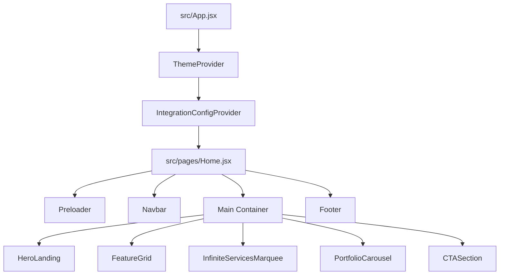

# DOCUMENTACIÓN TÉCNICA EXHAUSTIVA: PROYECTO FRONTEND '1998'

Este documento constituye la guía técnica oficial y definitiva para el desarrollo, mantenimiento y despliegue del proyecto frontend **1998**. Abarca desde la arquitectura general de la aplicación hasta las directivas específicas de rendimiento, diseño visual y animaciones avanzadas.

---

## 1. INTRODUCCIÓN

El proyecto frontend **1998** es la interfaz interactiva de la agencia digital homónima, especializada en desarrollo de software a medida, branding de gama alta, campañas publicitarias de conversión y automatización de procesos empresariales.

Diseñado bajo la filosofía estética **Premium Dark UI**, el sitio web combina un aspecto cinematográfico inmersivo con una arquitectura interactiva de alto rendimiento. Opera como una aplicación ágil con soporte nativo para la reducción de movimiento, renderizado óptimo en GPU y transiciones fluidas de luz y refracción. Su diseño busca generar una experiencia de marca impactante y sofisticada desde la primera interacción.

---

## 2. REQUISITOS PREVIOS

Para configurar y trabajar en la base de código del proyecto frontend, se deben cumplir los siguientes requisitos mínimos de software en la estación de desarrollo:

*   **Node.js**: Versión 18.0.0 o superior (LTS recomendada).
*   **Administrador de paquetes**: `npm` v9.0.0 o superior (incluido con Node.js), `yarn` o `pnpm`.
*   **Sistema Operativo**:
    *   **Windows**: Powershell 5+, Git Bash o CMD.
    *   **macOS / Linux**: Consola compatible con POSIX.
*   **Compatibilidad de Navegadores**: Navegadores modernos compatibles con:
    *   Variables CSS nativas.
    *   Filtros gráficos avanzados (`backdrop-filter` y `blur`).
    *   Animaciones por hardware (aceleración GPU).
    *   Flexbox y CSS Grid.

---

## 3. PASOS DE INSTALACIÓN Y CONFIGURACIÓN

Siga estas instrucciones para clonar el repositorio, configurar las dependencias necesarias e iniciar la aplicación localmente.

### Paso 1: Instalación de dependencias iniciales
Navegue al directorio raíz del proyecto frontend (`front_1998`) y ejecute:
```bash
npm install
```

### Paso 2: Instalación de la Suite de Animaciones GSAP
El proyecto utiliza GSAP para coordinar transiciones físicas, interpolaciones complejas y manipulación de scroll interactivo. Para garantizar la compatibilidad con React, instale GSAP y su adaptador oficial:
```bash
npm install gsap @gsap/react
```
> [!NOTE]
> La librería `@gsap/react` proporciona el hook `useGSAP`, el cual gestiona automáticamente el desmontaje de listeners y previene fugas de memoria (*memory leaks*) en el ciclo de vida de React.

### Paso 3: Ejecutar el Entorno de Desarrollo
Inicie el servidor de desarrollo rápido de Vite:
```bash
npm run dev
```
El servidor se levantará en `http://localhost:5173`. Dispone de Hot Module Replacement (HMR) para reflejar cambios en tiempo real.

### Paso 4: Compilación para Producción
Para construir el bundle estático y optimizado en la carpeta `/dist`:
```bash
npm run build
```
> [!IMPORTANT]
> **Aviso para Windows**: Si el script `build` en su `package.json` incluye directivas POSIX como `chmod +x`, modifíquelo en su entorno Windows para evitar errores en la terminal:
> ```json
> "scripts": {
>   "build": "vite build"
> }
> ```

---

## 4. ESTRUCTURA DE DIRECTORIOS

El proyecto está organizado modularmente, separando los tokens de diseño de la lógica interactiva y las páginas de nivel superior:

```txt
front_1998/
├── dist/                          # Código estático compilado listo para producción
├── docs/                          # Documentos de especificación técnica del proyecto
│   ├── DOCUMENTACION_TECNICA.md   # Guía del entorno de desarrollo
│   ├── DOCUMENTACION_TECNICA_EXHAUSTIVA.md  # [Este documento] Manual maestro
│   ├── 4-framework-de-integracion.md
│   ├── 5-blueprint-migracion-nextjs.md
│   └── 6-qa-y-normas-de-seguridad.md
├── public/                        # Activos públicos transferidos tal cual a producción
│   ├── fonts/                     # Tipografías corporativas (.woff2, .woff, .ttf)
│   ├── images/                    # Recursos visuales optimizados (PNG, WebP, AVIF)
│   └── videos/                    # Videos cortos optimizados para backgrounds (MP4, WebM)
├── src/                           # Código fuente de la aplicación React
│   ├── assets/                    # Assets procesados por el bundler (Vite)
│   ├── components/                # Componentes React con lógica de interfaz
│   │   ├── cards/                 # Tarjetas de datos (ej. MarketingCard.jsx)
│   │   ├── layout/                # Estructura del marco global (Navbar, Footer, Preloader)
│   │   ├── sections/              # Secciones principales de la landing (Hero, CTA, FeatureGrid)
│   │   └── PortfolioCarousel.jsx  # Carrusel horizontal con control programático
│   ├── design-system/             # Núcleo visual y tokens del sistema de diseño
│   │   ├── integration/           # Modos de migración y Feature Flags
│   │   ├── motion/                # Adaptadores de animación y Reduced Motion
│   │   ├── tokens/                # Estilos globales y tokens HSL (theme.css)
│   │   ├── ui/                    # Componentes atómicos (GlassCard, PremiumButton, RevealText)
│   │   └── utils/                 # Funciones helper (clsx/tailwind-merge - cn.js)
│   ├── pages/                     # Páginas principales del sitio (Home.jsx, AdminDashboard.jsx)
│   ├── App.jsx                    # Componente raíz y enrutador condicional básico
│   ├── index.css                  # Punto de entrada de estilos globales
│   └── main.jsx                   # Montaje inicial del DOM de React
├── index.html                     # Esqueleto HTML5 principal
├── jsconfig.json                  # Definición de rutas y alias de imports (@/*)
├── postcss.config.js              # Plugins del postprocesador de CSS
├── tailwind.config.js             # Configuración del compilador Tailwind CSS
└── vite.config.js                 # Configuración del empaquetador de la SPA (Vite)
```

---

## 5. ARQUITECTURA GENERAL (REACT Y NEXT.JS)

El proyecto frontend de **1998** sigue actualmente una arquitectura de Single Page Application (SPA) optimizada con React y Vite. No obstante, está planificado desde sus cimientos para permitir una transición directa a **Next.js (App Router)** sin necesidad de reescribir la lógica de visualización ni el sistema de diseño.



### 5.1. Proveedor de Integración y Feature Flags
El motor visual de la interfaz se rige por un proveedor centralizado (`IntegrationConfigProvider.jsx`) que evalúa el estado del sitio en tres modalidades de compatibilidad:

1.  **Modos de Migración (`migrationModes.js`)**:
    *   `SOFT` (`'soft'`): Desactiva staggers complejos y transiciones de alto coste de repintado. Recomendado para navegadores antiguos o dispositivos móviles.
    *   `HYBRID` (`'hybrid'`): Habilita interacciones avanzadas selectivas. Mantiene hovers fluidos y staggers de bajo coste (modo por defecto).
    *   `FULL` (`'full'`): Activa el 100% de la carga visual, incluyendo efectos de refracción masivos y layouts multicapa tridimensionales.

2.  **Catálogo de Interruptores (Feature Flags)**:
    Ubicados en `src/design-system/integration/featureFlags.js`, controlan dinámicamente qué características visuales inyectar en las vistas del cliente:
    *   `enableMotion`: Habilita o deshabilita animaciones físicas globales.
    *   `enableGlassEffects`: Activa filtros de desenfoque gaussianos en tarjetas.
    *   `enablePremiumUI`: Inyecta bordes reflectantes y gradientes dinámicos en los botones.

### 5.2. Blueprint de Migración a Next.js (App Router)
Al migrar el proyecto a Next.js, debe respetarse el modelo híbrido de renderizado para no penalizar el SEO.

*   **React Server Components (RSC - Por Defecto)**:
    Los componentes estructurales deben compilarse en el servidor para eliminar JS del cliente. Esto incluye:
    `Home.jsx`, `FeatureGrid.jsx`, `CTASection.jsx` y `Footer.jsx`.
*   **Client Components (`"use client"`)**:
    Aquellos que consumen APIs del navegador o registran animaciones con GSAP/Framer Motion deben inicializarse con la directiva `"use client"`:
    `Navbar.jsx`, `Preloader.jsx`, `PortfolioCarousel.jsx`, `InfiniteServicesMarquee.jsx` y los componentes de `src/design-system/ui/*`.

#### Mitigación de Errores de Hidratación (Hydration Mismatches)
Para evitar discrepancias entre el HTML generado por el servidor y el cliente (debido al uso de variables dinámicas como `window.innerWidth`), se utiliza un patrón de renderizado condicional diferido:

```javascript
import { useState, useEffect } from 'react';

export default function SafeClientWrapper({ children }) {
  const [mounted, setMounted] = useState(false);

  useEffect(() => {
    setMounted(true);
  }, []);

  if (!mounted) {
    // Caja de reserva estática que coincide exactamente con el renderizado del servidor (SSR)
    return <div className="fixed inset-0 bg-[#000000] z-[9999]" />;
  }

  return <>{children}</>;
}
```

---

## 6. GUÍA DE ESTILOS: TAILWIND CSS Y GLASSMORPHISM

El estilo visual de **1998** está construido sobre una paleta cromática sofisticada integrada con clases de utilidad avanzadas de Tailwind CSS.

### 6.1. Definición de Variables Cromáticas (`theme.css`)
Los colores se declaran en formato HSL dentro del elemento raíz del sistema para permitir transparencias alfa instantáneas en las clases CSS:

```css
@layer base {
  :root {
    --background: 0 0% 0%;                 /* Negro absoluto */
    --foreground: 0 0% 98%;                /* Blanco crudo */
    --card: 0 0% 0%;                       /* Superficies internas */
    --border: 0 0% 12%;                    /* Bordes de refracción delgados (luminosidad 12%) */
    --primary: 0 0% 98%;                   /* Elemento primario */
    --primary-foreground: 0 0% 9%;         /* Texto sobre primario */
    --glow-primary: 0 0% 98%;              /* Resplandor blanco */
    --glow-secondary: 217.2 91.2% 59.8%;   /* Resplandor azul destello */

    /* Fuentes del Sistema */
    --font-primary: 'Poppins', 'Inter', system-ui, sans-serif;
    --font-heading: 'Poppins', system-ui, sans-serif;
    --font-display: 'Klein Condensed', 'Impact', sans-serif;
  }
}
```

### 6.2. Tipografía Fluida (Fluid Scale)
Para evitar saltos bruscos entre breakpoints tipográficos, el proyecto inyecta escalas automáticas usando `clamp` de CSS en `@layer utilities`:

*   `.text-fluid-display`: `clamp(2.5rem, 6vw, 4.5rem)`
*   `.text-fluid-h1`: `clamp(2rem, 5vw, 3.5rem)`
*   `.text-fluid-body-large`: `clamp(1.05rem, 1.5vw, 1.125rem)`

### 6.3. Especificación del Sistema de Glassmorphism (Efecto Vidrio)
El efecto de vidrio interactivo de alta gama se compone de:
1.  Un color de fondo con transparencia adaptativa (`bg-card/60` o `bg-background/80`).
2.  Un desenfoque de los elementos situados detrás mediante `backdrop-filter`.
3.  Un borde fino (`border-border`) que genera el efecto de refracción de luz en las aristas del vidrio.

Las dos clases utilitarias de Tailwind se centralizan en la capa de utilidades:
```css
@layer utilities {
  /* Efecto Vidrio Estándar */
  .glass {
    @apply bg-card/60 backdrop-blur-md border border-border;
  }
  
  /* Efecto Vidrio Intenso (Navbar flotante) */
  .glass-intense {
    @apply bg-background/80 backdrop-blur-xl border-b border-border;
  }
}
```

#### El Componente `GlassCard.jsx`
Este componente atómico empaqueta los estilos de vidrio y les añade interactividad física 3D en hover mediante interpolación de estados:

```javascript
import { cn } from '../utils/cn';
import { HoverMotion } from './HoverMotion';

export const GlassCard = ({ 
  children, 
  className, 
  interactive = false,
  intensity = 'base', // 'base' | 'intense'
  as: Component = 'div'
}) => {
  const intensityClass = intensity === 'intense' ? 'glass-intense' : 'glass';

  const CardContent = (
    <Component className={cn(
      intensityClass,
      "rounded-2xl p-6 transition-colors duration-400 hover:bg-card/80", 
      className
    )}>
      {children}
    </Component>
  );

  if (interactive) {
    return (
      <HoverMotion>
        {CardContent}
      </HoverMotion>
    );
  }

  return CardContent;
};
```

---

## 7. CONFIGURACIÓN Y USO DE ANIMACIONES AVANZADAS CON GSAP

GSAP proporciona la base física e interactiva para los comportamientos de scroll más complejos y las transiciones dinámicas no lineales de la landing page.

### 7.1. Inicialización y Registro de Plugins
El registro de plugins se realiza en el archivo del componente a nivel de módulo, evitando sobrecargas de rendimiento en el ciclo de actualización de React:

```javascript
import { gsap } from 'gsap';
import { ScrollTrigger } from 'gsap/ScrollTrigger';
import { useGSAP } from '@gsap/react';

// Registrar ScrollTrigger de forma segura
gsap.registerPlugin(ScrollTrigger);
```

### 7.2. Adaptabilidad de Movimiento (Reduced Motion)
Para garantizar la accesibilidad, todas las animaciones basadas en GSAP deben evaluar si el usuario ha habilitado la opción de movimiento reducido en el sistema operativo:

```javascript
// Comprobación segura del estado físico en el cliente
const prefersReduced = window.matchMedia('(prefers-reduced-motion: reduce)').matches;
```

---

### 7.3. Ejemplos Prácticos de Animaciones GSAP en Componentes

#### A. Efecto de Apilamiento 3D en Scroll (`InfiniteServicesMarquee` con GSAP)
Este script ancla las tarjetas en la pantalla usando `sticky` y, a medida que el scroll avanza, GSAP aplica un escalado hacia atrás y disminuye la opacidad para simular profundidad física:

```javascript
import { useRef } from 'react';
import { gsap } from 'gsap';
import { ScrollTrigger } from 'gsap/ScrollTrigger';
import { useGSAP } from '@gsap/react';
import { GlassCard } from '@/design-system/ui/GlassCard';

gsap.registerPlugin(ScrollTrigger);

export const InfiniteServicesMarquee = ({ services }) => {
  const containerRef = useRef(null);
  const cardsRef = useRef([]);

  useGSAP(() => {
    // Accesibilidad: cancelar efecto físico si prefiere movimiento reducido
    if (window.matchMedia('(prefers-reduced-motion: reduce)').matches) return;

    const cards = cardsRef.current;
    
    cards.forEach((card, index) => {
      if (index === cards.length - 1) return; // La última tarjeta permanece plana

      const scaleTransform = 1 - (cards.length - 1 - index) * 0.05;

      gsap.to(card, {
        scrollTrigger: {
          trigger: card,
          start: 'top 15%',
          end: 'bottom 15%',
          scrub: true, // Vincula la progresión de la animación directamente al scroll
        },
        scale: scaleTransform,
        opacity: 0.5,
        ease: 'power1.inOut',
      });
    });
  }, { scope: containerRef });

  return (
    <section ref={containerRef} className="relative py-20 px-4 max-w-5xl mx-auto">
      <div className="space-y-24">
        {services.map((service, index) => (
          <div 
            key={service.id}
            ref={(el) => (cardsRef.current[index] = el)}
            className="sticky top-[15vh] w-full will-change-transform"
          >
            <GlassCard intensity="intense" className="relative overflow-hidden min-h-[400px]">
              <h3 className="text-3xl font-display uppercase tracking-tight mb-4">{service.title}</h3>
              <p className="text-foreground/80 max-w-xl">{service.description}</p>
            </GlassCard>
          </div>
        ))}
      </div>
    </section>
  );
};
```

#### B. Animación de Salida del Preloader (SVG Liquid Curtain)
Esta animación modifica la curvatura de la base de un path SVG para crear el efecto visual de una "cortina líquida" de eyección rápida:

```javascript
import { useRef, useState } from 'react';
import { gsap } from 'gsap';
import { useGSAP } from '@gsap/react';

export const Preloader = ({ onComplete }) => {
  const containerRef = useRef(null);
  const pathRef = useRef(null);
  const [dimensions, setDimensions] = useState({ width: 0, height: 0 });

  useGSAP(() => {
    const width = window.innerWidth;
    const height = window.innerHeight;
    setDimensions({ width, height });

    const timeline = gsap.timeline({
      onComplete: () => onComplete()
    });

    const targetFlat = `M0 0 L${width} 0 L${width} 0 Q${width/2} 0 0 0 Z`;

    timeline.to(pathRef.current, {
      duration: 1.2,
      attr: { d: targetFlat },
      ease: 'power4.inOut',
      delay: 0.8
    });

    timeline.to(containerRef.current, {
      duration: 0.4,
      opacity: 0,
      pointerEvents: 'none'
    }, '-=0.4');

  }, { scope: containerRef });

  return (
    <div ref={containerRef} className="fixed inset-0 z-[9999] flex items-center justify-center bg-black">
      <svg className="absolute top-0 left-0 w-full h-[calc(100%+300px)] pointer-events-none fill-black">
        <path 
          ref={pathRef}
          d={dimensions.width ? `M0 0 L${dimensions.width} 0 L${dimensions.width} ${dimensions.height} Q${dimensions.width/2} ${dimensions.height + 250} 0 ${dimensions.height} Z` : ''} 
        />
      </svg>
      <div className="z-10 text-center font-display text-4xl uppercase tracking-widest text-white">
        1998
      </div>
    </div>
  );
};
```

#### C. Levitación Perpetua Condicional (`AntiGravity` con GSAP)
Proporciona un vaivén suave en el eje Y a elementos flotantes. Desactiva el proceso automático en CPU si el usuario solicita Reduced Motion:

```javascript
import { useRef } from 'react';
import { gsap } from 'gsap';
import { useGSAP } from '@gsap/react';

export const AntiGravity = ({ children, className = '', delay = 0, duration = 4, yDistance = -12 }) => {
  const elementRef = useRef(null);

  useGSAP(() => {
    if (window.matchMedia('(prefers-reduced-motion: reduce)').matches) return;

    gsap.to(elementRef.current, {
      y: yDistance,
      duration: duration,
      repeat: -1,
      yoyo: true,
      ease: 'sine.inOut',
      delay: delay
    });
  }, { scope: elementRef });

  return (
    <div ref={elementRef} className={`will-change-transform ${className}`}>
      {children}
    </div>
  );
};
```

---

## 8. USO DE COMPONENTES CLAVE

### 8.1. `Navbar` (`Navbar.jsx`)
La barra de cabecera controla de forma coordinada el desplazamiento por la landing page e implementa efectos translúcidos al descender en la página:
*   **Propiedades (Props)**:
    *   `isLoading` (`boolean`): Oculta el menú a `-100px` verticales mientras el Preloader está cargando recursos para evitar parpadeos interactivos.
*   **Control de Scroll Lock**:
    Al desplegar el menú de pantalla completa en dispositivos móviles, inyecta dinámicamente `overflow: hidden` al elemento raíz `body` para evitar desplazamientos accidentales detrás del overlay.

### 8.2. `PortfolioCarousel` (`PortfolioCarousel.jsx`)
Organiza las tarjetas de proyectos destacados del portafolio.
*   **Comportamiento responsivo**:
    Calcula en tiempo real la cantidad de tarjetas visibles basadas en breakpoints físicos, controlando la traslación lineal en PC e interpolando el desplazamiento nativo `scroll-snap` en dispositivos táctiles.
*   **Botón Premium Integrado**:
    Inyecta un botón reflectante que aprovecha un pseudo-elemento expandido (`before:absolute before:inset-0`) para permitir que la tarjeta completa sea interactiva sin contaminar la semántica HTML del enlace.

### 8.3. `RevealText` (`RevealText.jsx`)
Componente para la revelación cinematográfica de títulos de sección.
*   **Mecanismo**: Enmascara el texto bajo un contenedor con `overflow-hidden` y traslada verticalmente los caracteres o bloques desde la máscara en secuencia rápida (stagger reveal).

---

## 9. QA, RENDIMIENTO Y SEGURIDAD EN PRODUCCIÓN

Para asegurar un despliegue sin degradación de velocidad o compatibilidad, el código debe someterse a las siguientes comprobaciones de QA:

### 9.1. Prevención del Layout Thrashing
Está terminantemente prohibido leer y escribir de forma sucesiva en el DOM en bucles rápidos.
*   Todas las mediciones físicas (`offsetWidth`, `clientHeight`) deben realizarse durante las fases de montaje (`useEffect` o `useGSAP`) y guardarse en memoria intermedia.
*   Inyecte siempre la clase `will-change-transform` en los elementos que sufran traslaciones continuas o escalamientos en pantalla.

### 9.2. Estándar de la Capa de Apilamiento (Z-Index)
Para evitar colisiones de interactividad, se define una jerarquía estricta de variables `z-index`:
*   `z-[9999]`: Reservado exclusivamente para componentes obstructivos globales (`Preloader`).
*   `z-50`: Cabecera y menús flotantes superiores (`Navbar`).
*   `z-40`: Paneles contextuales e interactivos secundarios (dropdowns, modales locales).
*   `z-10`: Elementos interactivos dentro del flujo principal del documento (`PortfolioCarousel`, botones).
*   `z-0`: Vídeos de fondo y efectos decorativos inertes.

### 9.3. Optimización de Contenidos Multimedia
Dado que el peso acumulado de los vídeos de fondo afecta drásticamente el índice de rendimiento de Google Core Web Vitals:
1.  **Límite de tamaño**: Ningún vídeo de fondo debe exceder los **2.5 MB** en producción.
2.  **Formatos adaptativos**: Utilice la etiqueta de vídeo responsiva sirviendo el formato `.webm` prioritariamente, con fallback en `.mp4` para navegadores macOS/iOS antiguos:
    ```html
    <video loop muted playsinline>
      <source src="/videos/bg-hero.webm" type="video/webm">
      <source src="/videos/bg-hero.mp4" type="video/mp4">
    </video>
    ```
3.  **Compresión de imágenes**: Las imágenes ubicadas en `public/images/` deben optimizarse y convertirse a formatos modernos (`.webp` o `.avif`) antes de su subida final.

### 9.4. Estándar de Enlaces Externos (Seguridad)
Cualquier anclaje HTML que redirija a dominios externos utilizando la directiva `target="_blank"` debe contar de manera mandatoria con el parámetro:
```html
rel="noopener noreferrer"
```
Esto previene ataques de redirección inversa maliciosa (*tabnabbing*) y asegura la integridad de la sesión del cliente en su navegador.
